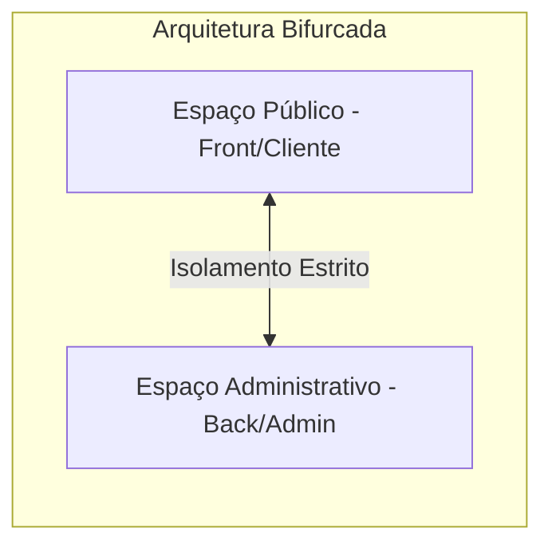
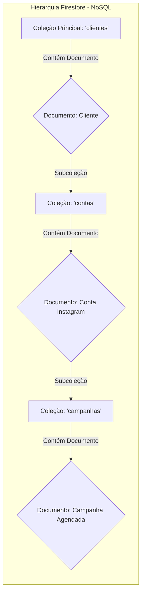
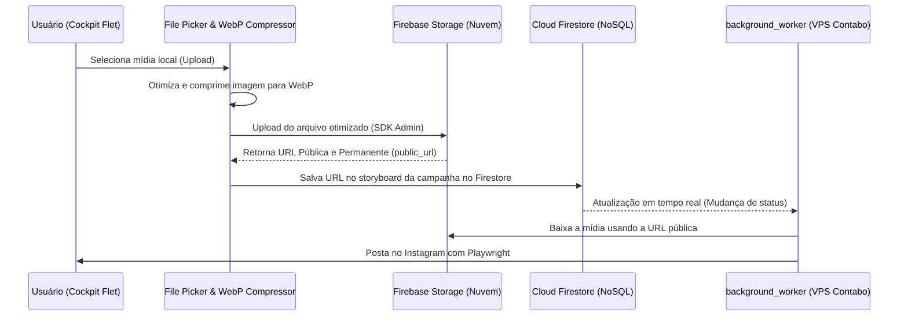
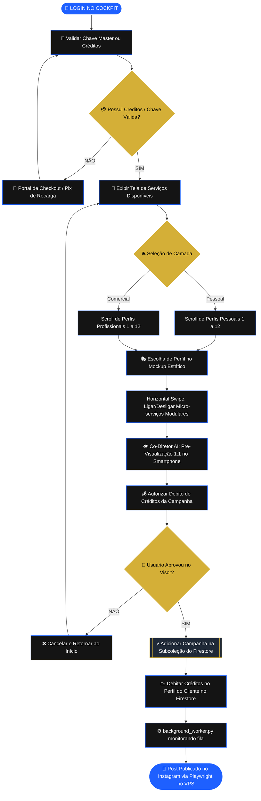

# 📐 VIÉS EPISTEMOLÓGICO: O SABER (ESTRUTURA & ENGENHARIA)
## Projeto Killer Skills — Versão Unificada 1.0 (Maio de 2026)

Este documento unifica e consolida toda a arquitetura técnica, modelagem de dados, integrações de APIs, e especificações de interface do ecossistema **Killer Skills**. Ele serve como a única fonte de verdade para a engenharia de software do projeto.

---

## 1. ARQUITETURA BIFURCADA DO SISTEMA

Para garantir blindagem contra acessos indevidos, proteção de credenciais críticas e uma experiência de usuário sem sobrecarga, o sistema é dividido em dois espaços funcionais independentes:

### 1.1. Espaço Público / Operacional (Front-End & Clientes)
*   **Finalidade:** Curadoria estética de alto nível, timeline visual, uploads rápidos e agendamento de campanhas.
*   **Tecnologia:** Interface Flet (Python) rodando localmente (Desktop) ou em navegador web, consumindo dados diretamente em tempo real do Cloud Firestore.
*   **Acesso:** Clientes finais e estrategistas de marcas (ex: Ingrid).

### 1.2. Espaço Administrativo / Desenvolvimento (Back-End & Engenharia)
*   **Finalidade:** Painel ADM privativo da Mesa Redonda para manutenção de infraestrutura, deploys rápidos, monitoramento de desempenho de workers e orquestração do background worker.
*   **Tecnologia:** Console seguro, PM2 para monitoramento de processos, e scripts de deploy automático (`deploy.sh`/`run.sh`).
*   **Acesso:** Equipe de engenharia e administradores de sistema.

---

## 2. A INTERFACE SUPREMA: SMARTPHONE MOCKUP 3D
A interface do usuário adota a doutrina da **Unidade Estática Suprema** para atingir usabilidade premium de luxo.

### 2.1. O Mockup Estático e a Física de Redes Sociais
*   **A Moldura Física:** O Smartphone virtual 3D permanece imóvel no centro físico da tela, apresentando um estilo iPhone moderno com cantos arredondados, notch dinâmico e glow neon azul/ouro adaptável.
*   **O Vácuo Cinematográfico:** O fundo do app é um gradiente ultra-escuro (`#050505`) translúcido com efeito de vidro (`glassmorphism`) e blur suave.
*   **Transição Crossfade:** Ao navegar de tela, a moldura do celular não se move; apenas o visor interno do smartphone virtual sofre transição crossfade ultra-fluida, mantendo o usuário focado e imerso.

### 2.2. A Física Nativa de Navegação e Configuração
Em vez de formulários técnicos poluídos ou menus complexos, toda a configuração de postagem ocorre dentro do celular simulado por gestos e física inspirada nas próprias redes sociais:

1.  **Escolha de Persona (Navegação Vertical - Scroll de Reels):**
    *   O usuário seleciona qual dos **24 Serviços Disponíveis (Perfis de Posicionamento)** será ativo para o cliente atual, deslizando verticalmente pelo visor. Cada deslize revela um card artístico premium do perfil com seu tom e regras.
2.  **Configuração de Micro-serviços (Navegação Horizontal - Swipe de Carrossel):**
    *   Ao parar no perfil desejado, o usuário desliza horizontalmente (carrossel) pela tela do celular.
    *   Cada slide horizontal exibe interruptores (toggles) táteis elegantes para ligar ou desligar os **micro-serviços modulares** necessários para a postagem atual (ex: *Ativar Transcrição*, *Geração de Legenda*, *Compactar WebP* ou *Gerar Imagem AI*).

---

## 3. MICRO-SERVIÇOS REUTILIZÁVEIS & GATEWAY MASTER

O cérebro narrativo e técnico do Killer Skills é estruturado em blocos lógicos desacoplados e altamente escaláveis:

### 3.1. Os Micro-serviços Modulares
*   **Micro-serviço de Transcrição (Whisper AI):** Converte gravações de voz brutas enviadas pelo usuário em arquivos de texto estruturados, com filtragem de ruídos linguísticos.
*   **Micro-serviço de Coprodução Textual (LLMs via OpenRouter):** Polimento semântico de legendas, criação de pautas de ganchos, quebra de linhas para leitura leve e escolha de hashtags corporativas.
*   **Micro-serviço Técnico de Compressão:** Otimizador local automático que converte qualquer formato de imagem arrastado para o painel em `.webp` de alta qualidade com redução drástica de peso.
*   **Micro-serviço de Imagem e Vídeo Generativo (Luma/Fal/Flux API):** Gera artes minimalistas de fundo ou inpaint contextualizado para imagens corporativas.

### 3.2. A UX da Chave Master via OpenRouter
Para eliminar o atrito de onboarding (onde o usuário final teria que obter chaves de API individuais da OpenAI, Anthropic, Fal.ai, etc.), o Killer Skills implementa o gateway de **Chave Master Única**:
*   O sistema hospeda uma chave master corporativa segura da **OpenRouter** em suas variáveis de ambiente no VPS Contabo.
*   Isso unifica e destrava dezenas de LLMs e modelos de imagem de ponta sob uma única conexão estável.
*   A Killer Skills custeia o tráfego bruto (fração de centavos) e o debita do saldo em créditos locais do usuário, gerando uma taxa de faturamento simplificada no modelo pré-pago.

---

## 4. MODELO DE PERSISTÊNCIA & BANCOS DE DADOS

O Killer Skills adota uma arquitetura de banco de dados 100% Cloud-Native e NoSQL para garantir concorrência thread-safe, eliminação de arquivos locais vulneráveis e sincronização instantânea em nuvem multidisciplinas:

### 4.1. Banco Documental Cloud Firestore (NoSQL)
A única fonte de verdade em nuvem para segregação multilocatária e atualização reativa em tempo real entre o app desktop, a interface Flet e o servidor VPS.

#### A. Coleção `clientes`
*   `nome` (string), `empresa` (string), `camada` (string - Pessoal/Comercial), `sub_categoria` (string - Preset ativo das 24 Personas), `logo_url` (string), `saldo_creditos` (number).

#### B. Subcoleção `contas` (Aninhada em `clientes/{cliente_id}/contas`)
*   `username` (string - ID único do perfil), `avatar_url` (string), `meta_token` (string - token social OAuth 2.0 Meta), `account_type` (string).

#### C. Subcoleção `campanhas` (Aninhada em `clientes/{cliente_id}/contas/{username}/campanhas`)
*   `data_programada` (timestamp), `legenda` (string), `status` (string - pendente/sucesso/falha), `flow_transitions` (array of strings), `log_erro` (string).
*   `storyboard` (array of maps) - Vetor contendo até 4 mídias aninhadas diretamente:
    *   `frame_index` (int - 0 a 3), `media_path` (string - URL pública Storage), `tipo` (string - imagem/video).

---

## 5. INTEGRAÇÃO FIREBASE STORAGE: FLUXO DE DADOS CLOUD-NATIVE

Todas as mídias da biblioteca (fotos e vídeos) são armazenadas centralizadamente na nuvem do Google Cloud. Isso elimina a dependência de arquivos locais compartilhados e garante latência zero no download pelo VPS de produção.

### 5.1. Métricas e Configurações Técnicas
*   **Bucket ID Padrão:** `gen-lang-client-0513318140.firebasestorage.app`
*   **Método `upload_media(local_path, destination_path=None)`:**
    *   Identifica dinamicamente MIME-types (webp, mp4).
    *   Faz o upload via Firebase SDK e força a política de leitura pública permanente do arquivo (`blob.make_public()`).
    *   Retorna a URL HTTP final estável acessível instantaneamente tanto pelo bot Playwright no VPS Contabo quanto pelo visualizador Flet no cliente.

---

## 6. FLUXOGRAMA DE PROCESSO BPMN UNIFICADO
Mapeamento lógico do login social até a postagem final com os workers em segundo plano:

---
*Assinado e Selado em Conformidade Epistemológica.*  
*Genera & Lincoln — Maio de 2026.*
