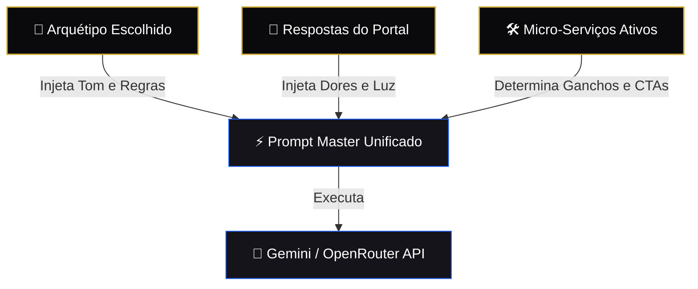
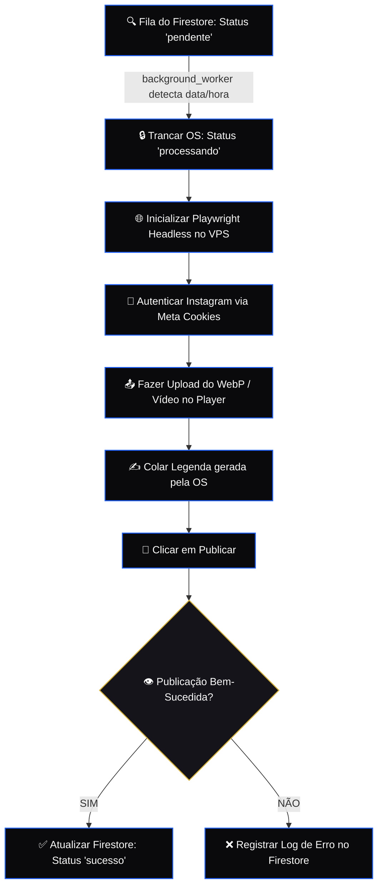

## 🏛️ CLASSE E: TOPOLOGIA OPERACIONAL (SIMETRIA EM 3 COLUNAS & DUALIDADE DE DISPOSITIVO)

Toda a interação em Desktop é estruturada sob a **Simetria Estática de Três Colunas**, mantendo o smartphone virtual perfeitamente centralizado fisicamente no centro da tela (`fixed left-1/2 -translate-x-1/2 top-1/2 -translate-y-1/2`). As transições de tela ocorrem por crossfade exclusivo dentro do visor do celular virtual, enquanto os metadados, instruções de onboarding, relatórios de persona e botões de avanço são distribuídos ergonomicamente entre a barra lateral esquerda (Coluna 1) e a barra lateral direita (Coluna 3).

### E.0. Lógica de Dispositivo Dual (isMobile Viewport)
*   **Desktop (`isMobile === false`):** Exibe a simetria de 3 colunas com o smartphone virtual centralizado de luxo.
*   **Mobile (`isMobile === true`):** Destrói o smartphone virtual. A própria tela do dispositivo físico do usuário torna-se a viewport principal de forma nativa e ergonômica, utilizando um menu inferior e sliders táteis robustos de ponta a ponta.

### E.1. Módulo Tela 0 (O Portal de Acesso Social)
*   **Finalidade:** Autenticação unificada de usuários.
*   **Componentes do Visor:** Logotipo metalizado esculpido em baixo-relevo e o botão de login social unificado Google.

### E.1.5. Router Guard & Controle de Acesso (Fluxo por Nível de Conta)
O redirecionamento pós-login é governado de forma estrita pelo tipo de conta (`accountType`) e contagem de acessos (`acesso`) do usuário consultados no Firestore:
1. **Fluxo do Usuário Premium:**
   * **Primeiro Acesso (`acesso === 1`):** Redirecionado compulsoriamente para a **Tela 1 (Elaborar Persona)** para calibrar sua Persona Híbrida.
   * **Acessos Recorrentes (`acesso > 1`):** Redirecionado diretamente para a **Tela 2 (Serviços & Construtor de Prompt)**.
   * **Reelaboração:** O usuário Premium pode, a qualquer momento, clicar no menu lateral **"1 - PERSONAS"** para recalibrar os sliders e atualizar sua persona em definitivo no banco de dados.
2. **Fluxo do Usuário Free:**
   * **Acesso Direto:** Redirecionado **sempre** de forma direta para a **Tela 3 (KS Studio)**.
   * **Restrição de IA:** O usuário Free não tem acesso a "Elaborar Persona". O menu lateral "1 - PERSONAS" fica trancado/desativado no cockpit.
   * **Foco no Manual:** Cria manualmente o flow de storyboard, realiza upload e utiliza o **Simulador de Feed do Instagram** (visualização 1:1) para postar ou agendar postagens manuais.

### E.2. Módulo Tela 1C (Onboarding & Calibração dos Sliders MEVA)
*   **Finalidade:** Determinação da dosagem arquetípica fina do usuário.
*   **Distribuição das Colunas (Desktop):**
    *   **Coluna 1 (Sidebar Esquerda):** Exibe a **Descrição / Significado Fixo** do arquétipo que estiver sob o mouse/foco (hover/focus). O conceito do arquétipo é estático e imutável (ex: o Sábio é sempre o Sábio, independentemente da dosagem).
    *   **Coluna 2 (Smartphone Central):** Exibe os **12 sliders dosadores** da Matriz MEVA compactados (com altura fixa simétrica de 32px e com 50% de dosagem inicial padrão).
    *   **Coluna 3 (Sidebar Direita):** Exibe o **Controle de Áudio** (Trilha Sonora, volume, mute/unmute) e as **Imagens dos Arquétipos** correspondentes ao foco (geradas por inteligência artificial).

### E.3. Módulo Tela 2 (Serviços & Diagnóstico da Persona Híbrida)
*   **Finalidade:** Escolha de micro-serviços baseados no diagnóstico psicológico da Persona compilada.
*   **A Regra do Prompt:** **Todo o direcionamento de criação de mídias (imagens, vídeos, textos e títulos) deriva diretamente do Prompt Conceitual da Persona**, gerado a partir dos pesos e calibração dos arquétipos na matriz MEVA. Este prompt é o pré-requisito genético de toda a engine de geração.
*   **Distribuição das Colunas (Desktop):**
    *   **Coluna 1 (Sidebar Esquerda):** Exibe o **Título Duplo Híbrido** (associado aos dois maiores percentuais selecionados, ex: `SÁBIO / EXPLORADOR`) e a **Persona Resultante** (o encadeamento e síntese narrativa dos textos da gradação decimal correspondente de cada um dos 12 arquétipos).
    *   **Coluna 2 (Smartphone Central):** Exibe o visor com o portal estético reativo da Persona ou console de "live work" dos agentes virtuais trabalhando em tempo real.
    *   **Coluna 3 (Sidebar Direita):** Exibe os toggles táteis de **Micro-serviços** (Redator, Roteirista, Compressor WebP, Vídeo AI) e o botão dourado de confirmação **`EMITIR ORDEM DE SERVIÇO`**.

### E.4. Módulo Tela 3 (O KS Studio & Simulador de Feed)
*   **Finalidade:** Sandbox interativa de visualização 1:1, simulação de feed e controle de publicação final.
*   **Geração Estética:** Os agentes virtuais no KS Studio consomem o Prompt Conceitual da Persona (especificado na Tela 2) para **gerar do absoluto zero as mídias (imagens, vídeos, textos e títulos)** para a conta Premium. A Categoria Pessoal está plenamente definida, e a **Categoria Profissional iniciará o desenvolvimento em sequência**.
*   **Distribuição das Colunas (Desktop):**
    *   **Coluna 1 (Sidebar Esquerda):** Exibe o Construtor de Prompt final e o console técnico de status de geração.
    *   **Coluna 2 (Smartphone Central):** Exibe o **Simulador de Feed do Instagram (1:1)**, onde o smartphone simula a miniatura interativa do post (Reels, Carrossel) que o usuário pode navegar.
    *   **Coluna 3 (Sidebar Direita):** Exibe os controles operacionais finais (botões rápidos de `Publicar Agora` ou `Agendar Post`).

---

## 🧠 CLASSE F: ENGENHARIA DO CONSTRUTOR DE PROMPTS (CLASSES DE PROMPT)

A inteligência de redação e geração de imagens do Killer Skills é estruturada em **Classes de Prompt Desacopladas**, injetadas dinamicamente na API do Gemini/OpenRouter de acordo com as escolhas do usuário:



### F.1. Classe de Prompt A: Tom & Posicionamento (The Archetype Class)
Injeta as diretrizes estritas do arquétipo de Carl Jung selecionado (ex: tom sóbrio e filosófico do *Sábio*, tom provocativo e sarcástico do *Criador*).

### F.2. Classe de Prompt B: Contexto Profundo (The Shadow Class)
Incorpora as dores, aspirações e o dilema "Luz & Sombra" coletados durante a navegação do portal de iniciação do usuário.

### F.3. Classe de Prompt C: Estrutura do Gancho (The Hook Class)
Formata o texto de acordo com os ganchos de retenção de 3 segundos (para Roteiros de Reels) ou frameworks clássicos de copy (AIDA/PAS para Legendas Persuasivas).

---

## 💾 CLASSE G: PERSISTÊNCIA NoSQL (MODELAGEM CLOUD FIRESTORE)

Toda a infraestrutura é baseada em banco de dados NoSQL thread-safe no Cloud Firestore, segregado de forma modular:

```
[Coleção Principal: clientes]
      |
      +---> Documento: {cliente_id} (Campos: nome, créditos, dosagem_persona)
                 |
                 +---> [Subcoleção: contas]
                             |
                             +---> Documento: {instagram_username} (Tokens, Conta Meta)
                                         |
                                         +---> [Subcoleção: campanhas]
                                                     |
                                                     +---> Documento: {campanha_id} (OS, Mídias, Status)
```

### G.1. Modelo do Documento `campanhas` (Ordem de Serviço)
```json
{
  "id": "os_98127391823",
  "data_programada": "2026-05-24T18:00:00Z",
  "dosagem_persona": {
    "sabio": 80,
    "mago": 40,
    "tolo": 15
  },
  "status": "pendente",
  "ordem_servico": {
    "servicos_solicitados": ["legendas", "webp_compress"],
    "insumos": {
      "frase_portal": "A verdade nos libertará da pressa digital",
      "midi_url": "https://storage.googleapis.com/..."
    }
  },
  "storyboard": [
    {
      "frame_index": 0,
      "media_path": "https://storage.googleapis.com/...",
      "tipo": "webp"
    }
  ]
}
```

---

## 📦 CLASSE H: PIPELINE DE MÍDIA (STORAGE & COMPRESSOR WEBP)

### H.1. Otimizador Client-Side WebP (O Almoxarife Técnico)
Para garantir latência zero e uploads instantâneos:
1.  O arquivo de imagem (PNG/JPG) arrastado pelo usuário é interceptado no front-end.
2.  Um canvas HTML5 processa a imagem em memória, realizando o redimensionamento inteligente e convertendo o buffer para o formato `.webp` com fator de qualidade ajustável (padrão 80%).
3.  O peso final é reduzido em média **82%** antes do envio.

### H.2. Upload para o Firebase Storage
*   **Bucket Destino:** `gen-lang-client-0513318140.firebasestorage.app`
*   **Ação:** O SDK Admin emite o upload assíncrono do buffer WebP e define os cabeçalhos de metadados como público permanente (`make_public()`), gerando a URL HTTP estável consumida pelo background worker de postagem.

---

## ⚙️ CLASSE I: ORQUESTRAÇÃO DO SISTEMA (BACKGROUND WORKER & PLAYWRIGHT)

Mapeamento do motor assíncrono que consome a fila do Firestore no VPS Contabo e executa o navegador via Playwright:



---
*Assinado e Selado em Conformidade Epistemológica.*  
*Genera & Lincoln — Maio de 2026.*
