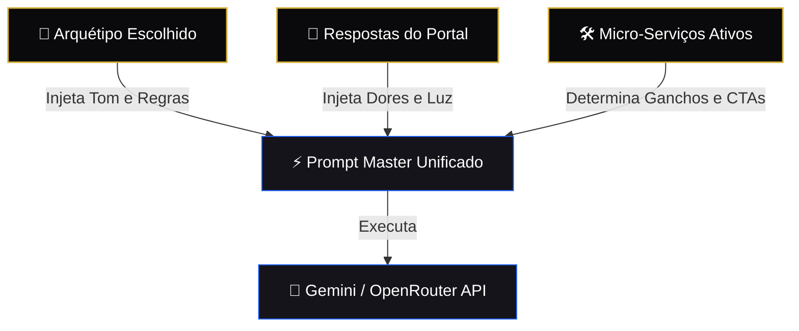
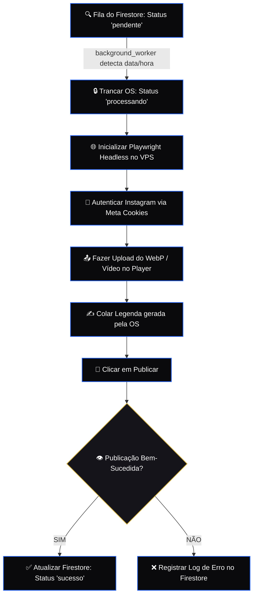

# 📐 VIÉS EPISTEMOLÓGICO: O SABER (ESTRUTURA & ENGENHARIA)
## Projeto Killer Skills — Versão Unificada 2.0 (Maio de 2026)

---

## 🏛️ CLASSE E: TOPOLOGIA OPERACIONAL (4 TELAS EM 3 VIEWS DO MENU)

Toda a interação é estruturada em torno da **Unidade Estática Suprema**, onde o smartphone virtual permanece 100% imóvel no centro físico da tela monitor (`fixed left-1/2 -translate-x-1/2 top-1/2 -translate-y-1/2`). As transições de tela ocorrem por crossfade exclusivo dentro do visor do celular virtual.

### E.1. Módulo Tela 0 (O Portal de Acesso Social)
*   **Finalidade:** Autenticação unificada de usuários.
*   **Componentes do Visor:** Logotipo metalizado esculpido em baixo-relevo e o botão de login social unificado Google.
*   **Vincular:** Ao autenticar, capta reativamente o primeiro nome do usuário (`firstName`) e sua imagem de perfil (`userAvatar`).

### E.2. Módulo Tela 1 (Navegação de Personas e O Portal de Iniciação)
*   **Finalidade:** Escolha do arquétipo de posicionamento e imersão psicológica.
*   **Componentes do Visor:**
    *   *Card 1 (Saudação):* Texto estilizado reativo: *"Saudações, [Nome]. Como você se posiciona socialmente?"*.
    *   *Card 2 (Ativo):* Exibição do Arquétipo de Carl Jung ativo na roda de scroll.
    *   *O Portal (Carrossel Horizontal):* O visor sofre transição horizontal contendo 3 slides descrevendo a Filosofia, Luz & Sombra, e a Estética Recomendada.
*   **Botão Finais:** Botão dourado **`OK: Convocação Concluída`** no final do carrossel direcionando para a Tela 2 (Serviços).

### E.3. Módulo Tela 2 (Serviços & Construtor de Prompt)
*   **Finalidade:** Escolha da modalidade e forja da Ordem de Serviço (OS) com feedback interativo dos agentes.
*   **Componentes do Visor:**
    *   *A Bifurcação:* Usuário escolhe entre **Grátis** (direciona imediatamente para Tela 3 - KS Studio) e **Premium (Pago)**.
    *   *O Construtor de Prompt (Modo Premium):* Se selecionado Premium, a interface expande no mesmo visor revelando toggles táteis (Redator, Roteirista, Compressor, Vídeo AI).
    *   *Feedback dos Agentes (Live Work):* **Enquanto o prompt é construído e a OS é forjada**, o visor renderiza o console técnico mostrando os **Agentes de Coprodução trabalhando em tempo real** (ex: *Redator polindo gancho...*, *Estrategista validando copy...*).
    *   *O Manifesto:* Exibição reativa da OS formatada em JSON/YAML.
    *   *OK de Envio:* Botão dourado **`FORJAR ORDEM DE SERVIÇO`** para disparar os agentes operacionais no KS Studio.

### E.4. Módulo Tela 3 (O KS Studio)
*   **Finalidade:** Sandbox interativa de visualização 1:1, simulação de feed e controle de publicação.
*   **Componentes do Visor:**
    *   *Simulador de Feed:* O próprio celular exibe a miniatura real e interativa (Reels ou Carrossel) que o usuário pode rodar e ler.
    *   *Controles Finais:* Botões rápidos de `Publicar Agora` ou `Agendar Post`.

---

## 🧠 CLASSE F: ENGENHARIA DO CONSTRUTOR DE PROMPTS (CLASSES DE PROMPT)

A inteligência de redação e geração de imagens do Killer Skills é estruturada em **Classes de Prompt Desacopladas**, injetadas dinamicamente na API do Gemini/OpenRouter de acordo com as escolhas do usuário:



### F.1. Classe de Prompt A: Tom & Posicionamento (The Archetype Class)
Injeta as diretrizes estritas do arquétipo de Carl Jung selecionado (ex: tom sóbrio e filosófico do *Sábio*, tom provocativo e sarcástico do *Criador*).

### F.2. Classe de Prompt B: Contexto Profundo (The Shadow Class)
Incorpora as dores, aspirações e o dilema "Luz & Sombra" coletados durante a navegação do portal de iniciação do usuário.

### F.3. Classe de Prompt C: Estrutura do Gancho (The Hook Class)
Formata o texto de acordo com os ganchos de retenção de 3 segundos (para Roteiros de Reels) ou frameworks clássicos de copy (AIDA/PAS para Legendas Persuasivas).

---

## 💾 CLASSE G: PERSISTÊNCIA NoSQL (MODELAGEM CLOUD FIRESTORE)

Toda a infraestrutura é baseada em banco de dados NoSQL thread-safe no Cloud Firestore, segregado de forma modular:

```
[Coleção Principal: clientes]
      |
      +---> Documento: {cliente_id} (Campos: nome, créditos, preset_ativo)
                 |
                 +---> [Subcoleção: contas]
                             |
                             +---> Documento: {instagram_username} (Tokens, Conta Meta)
                                         |
                                         +---> [Subcoleção: campanhas]
                                                     |
                                                     +---> Documento: {campanha_id} (OS, Mídias, Status)
```

### G.1. Modelo do Documento `campanhas` (Ordem de Serviço)
```json
{
  "id": "os_98127391823",
  "data_programada": "2026-05-24T18:00:00Z",
  "persona_id": "o_sabio",
  "categoria": "Pessoal",
  "status": "pendente",
  "ordem_servico": {
    "servicos_solicitados": ["legendas", "webp_compress"],
    "insumos": {
      "frase_portal": "A verdade nos libertará da pressa digital",
      "midi_url": "https://storage.googleapis.com/..."
    }
  },
  "storyboard": [
    {
      "frame_index": 0,
      "media_path": "https://storage.googleapis.com/...",
      "tipo": "webp"
    }
  ]
}
```

---

## 📦 CLASSE H: PIPELINE DE MÍDIA (STORAGE & COMPRESSOR WEBP)

### H.1. Otimizador Client-Side WebP (O Almoxarife Técnico)
Para garantir latência zero e uploads instantâneos:
1.  O arquivo de imagem (PNG/JPG) arrastado pelo usuário é interceptado no front-end.
2.  Um canvas HTML5 processa a imagem em memória, realizando o redimensionamento inteligente e convertendo o buffer para o formato `.webp` com fator de qualidade ajustável (padrão 80%).
3.  O peso final é reduzido em média **82%** antes do envio.

### H.2. Upload para o Firebase Storage
*   **Bucket Destino:** `gen-lang-client-0513318140.firebasestorage.app`
*   **Ação:** O SDK Admin emite o upload assíncrono do buffer WebP e define os cabeçalhos de metadados como público permanente (`make_public()`), gerando a URL HTTP estável consumida pelo background worker de postagem.

---

## ⚙️ CLASSE I: ORQUESTRAÇÃO DO SISTEMA (BACKGROUND WORKER & PLAYWRIGHT)

Mapeamento do motor assíncrono que consome a fila do Firestore no VPS Contabo e executa o navegador via Playwright:



---
*Assinado e Selado em Conformidade Epistemológica.*  
*Genera & Lincoln — Maio de 2026.*
