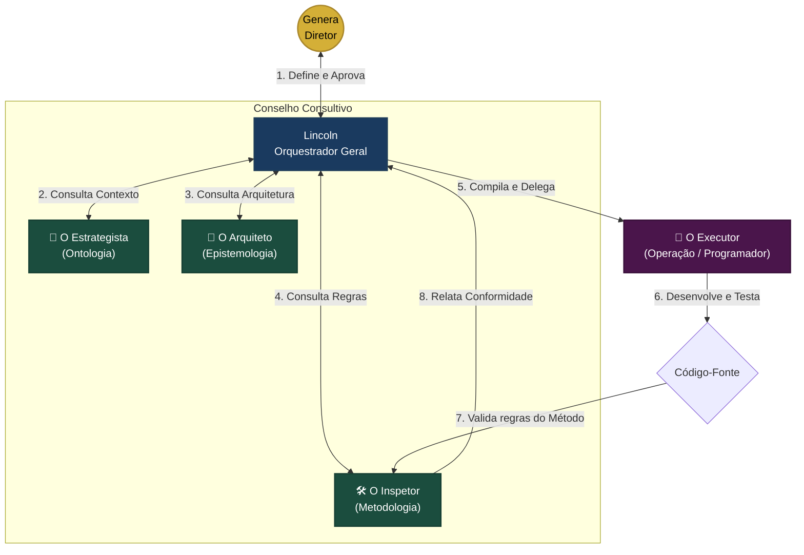

# 🛠️ VIÉS METODOLÓGICO: O FAZER (MÉTODO LINCOLN & OPERAÇÃO)
## Projeto Killer Skills — Versão Unificada 1.0 (Maio de 2026)

Este documento estabelece formalmente as regras sagradas de conduta, a divisão de forças da Mesa Redonda de agentes de coprodução, as diretrizes de desenvolvimento (Método Lincoln), as rotinas de deploy, e o cronograma operacional de tarefas do backlog do **Killer Skills**.

---

## 1. DIRETRIZES DE DESENVOLVIMENTO (AS REGRAS DE OURO)

### 1.1. Estabilidade Total (Imutabilidade do Validado)
*   **A Regra da Preservação:** **NADA** do que já foi construído, testado, validado e aprovado no ecossistema pode ser alterado, a menos que haja uma solicitação de alteração explícita, clara e específica por parte do usuário (Genera).
*   **Análise de Impacto Global:** Antes de qualquer alteração física em arquivos de código, o agente de desenvolvimento deve mapear as conexões globais, garantindo que componentes não relacionados continuem em pleno funcionamento.
*   **Preservação Estética:** Foco absoluto na preservação da formatação, estilos elegantes, temas e integridade visual dos arquivos originais.
*   **Sincronização da Documentação:** A documentação não é um registro passivo; ela é a consciência e o combustível da inteligência coletiva do projeto. Qualquer alteração de dados, de escopo ou de arquitetura deve ser refletida **imediatamente** e com precisão cirúrgica nos três arquivos mestre de viés (`1_ONTOLOGIA.md`, `2_EPISTEMOLOGIA.md`, `3_METODOLOGIA.md`).

### 1.2. Comunicação e Planejamento como Prioridades
*   **O Diálogo como Lei:** **Responder às dúvidas no chat e interagir com o usuário é infinitamente mais importante do que programar.** A comunicação é a prioridade; escrever código é a consequência secundária.
*   **Planejar antes de Executar:** A estratégia técnica de qualquer mudança física deve ser explicitamente validada e autorizada pelo Genera no chat antes de tocar em qualquer arquivo.
*   **Humildade Técnica:** Diante de qualquer incerteza sobre credenciais, conexões com o Firestore, tokens da Meta ou tabelas do banco de dados, o agente deve parar e solicitar ajuda humana ou validação ao usuário.

### 1.3. Trabalho em Conjunto e Soluções Universais
*   **Cooperação Estrita:** Nenhuma decisão arquitetural ou de design será tomada de forma autônoma pelo agente. O desenvolvimento é uma jornada estrita de parcerias e decisões conjuntas.
*   **Compartilhamento Prévio:** Cada bloco tático deve ser apresentado e compartilhado no chat antes de ser implementado. Nada deve ser feito com pressa.
*   **Código Universal e Modular:** **Jamais criar gambiarras ou soluções locais específicas** para uma única conta ou caso isolado. Todos os componentes devem ser universais e configuráveis por parâmetros salvos no banco de dados ou variáveis de ambiente `.env`.

---

## 2. A MESA REDONDA: BATALHÃO DE AGENTES DE COPRODUÇÃO

Para maximizar a produtividade e eliminar a sobrecarga cognitiva da IA, dividimos o processo de desenvolvimento em papéis altamente especializados, operando no padrão **Planner-Actor-Critic (Planejador-Ator-Crítico)**:

### 2.1. Genera (Armando — O Diretor Criativo Humano)
*   **Papel:** O decisor soberano do ecossistema. Define a visão estratégica, propõe as pautas, analisa os planos técnicos propostos e aprova formalmente todas as entregas do projeto.

### 2.2. Lincoln (Antigravity — O Orquestrador Geral / Maestro — IA)
*   **Papel:** O coordenador central e interface de coprodução direta com o Genera. Responsável por traduzir a visão criativa em planos operacionais detalhados, convocar o conselho e delegar tarefas cirúrgicas aos executores, agindo como o *Shield* que zela pelas regras de ouro.

### 2.3. O Conselho Consultivo (Os 3 Conselheiros — IA)
*   **🧠 O Estrategista (Viés Ontológico):** Garante a fidelidade das narrativas geradas, alinhando qualquer texto ou funcionalidade ao DNA dos 24 Perfis de Identidade (Serviços Disponíveis) cadastrados.
*   **📐 O Arquiteto (Viés Epistemológico):** Zela pelos padrões de arquitetura limpa, modularidade de workers, persistência thread-safe do SQLite, integridade de conexões Firestore/Storage e harmonia de cores e layouts do Flet.
*   **🛠️ O Inspetor Metodológico (Viés Metodológico):** Audita a conformidade de conduta do Executor. Verifica se os códigos criados não colidem com áreas já aprovadas e se os rituais de pausa e validação estão ativos.

### 2.4. O Agente Executor (O Soldado Programador — IA)
*   **Papel:** O programador cirúrgico. Responsável por traduzir as ordens de serviço geradas pelo Orquestrador em código-fonte de alta performance (Python, Flet, Playwright) e testes funcionais, sem desvios de escopo.

---

## 3. OS RITUAIS DE DESENVOLVIMENTO (MÉTODO LINCOLN)

1.  **Planejamento Extremo (Afiar o Machado):** Antes de tocar em qualquer arquivo funcional ou banco de dados, o agente deve propor em chat o que irá fazer, descrevendo os arquivos que serão alterados e como preservará a estabilidade global.
2.  **Estado "Em Planejamento":** Sempre que o Genera invocar ou digitar "Em Planejamento" (ou "Ainda Em Planejamento"), o agente de desenvolvimento entra em modo estrito de diálogo e análise conceitual. **Fica terminantemente proibido alterar qualquer arquivo de código ou base de dados.** O foco é 100% no refinamento de ideias.
3.  **Regra "Apenas Responda":** Se o Genera utilizar a instrução "Apenas responda", o agente suspende qualquer execução de script ou escrita, limitando-se a explicar sua linha de raciocínio no chat e aguardar a validação explícita humana antes de agir.
4.  **Respeito ao Contexto:** Evitar modificações em componentes globais do aplicativo (como Sidebar Metálica ou timers gerais) se o escopo da tarefa se limitar a uma tela isolada.
5.  **Pausa para Validação:** Quebrar entregas massivas em pequenos blocos operacionais rápidos, pausando após a conclusão de cada bloco para que o Genera possa avaliar, testar fisicamente e autorizar o avanço.

---

## 4. INFRAESTRUTURA DE PRODUÇÃO & RITUAL DE DEPLOY

*   **Ambiente VPS:** Servidor Contabo (IP `31.220.102.2`), rodando em ambiente Linux sob controle de processos PM2 (`pm2 restart killer-skills`).
*   **Domínio Oficial Ativo:** `www.killerskills.com.br` (configurado e no ar).
*   **A DX Suprema do Deploy Automatizado:** O script local `run.sh` executa automaticamente `deploy.sh` na inicialização do cockpit desktop. O fluxo garante:
    1.  Toda alteração de código local seja rastreada, adicionada e commitada com timestamp no Git.
    2.  As alterações sejam empurradas ao GitHub (`git push`).
    3.  O servidor VPS Contabo puxe a atualização de código (`git pull`) e reinicie o processo PM2 (`pm2 restart killer-skills`).
    4.  A versão de produção web (`www.killerskills.com.br`) e a versão desktop local permaneçam 100% sincronizadas instantaneamente.

---

## 5. CRONOGRAMA OPERACIONAL E BACKLOG DE TASKS

### 🚨 NÍVEL 1: PRIORIDADE CRÍTICA (AFIAÇÃO DE FERRAMENTAL)
*   [x] **Tarefa 0.1 (Construtor de Prompt - Estágio 1):** Criar o script compilador CLI em Python `scripts/compilar_prompt.py` que lê os viéses em `/docs/` e gera prompts estruturados no clipboard. *(Concluído em 20 de Maio de 2026)*
*   [x] **Tarefa 0.2 (Lançador Desktop & Atalho Ubuntu 24.04):** Criar script de inicialização automática `run.sh` com reciclagem de portas, instalador `install_launcher.py` que integra o atalho dourado KS no menu de aplicativos do Ubuntu 24.04 e atalho na Área de Trabalho com correção gráfica de `libmpv`. *(Concluído em 21 de Maio de 2026)*

### 🔴 NÍVEL 2: PRIORIDADE ALTA (MVP FASE 1 - O CÉREBRO E BASTIDORES)
*   [x] **Tarefa 1.1:** Criar o módulo de Banco de Dados (`database.py`) - Estrutura Cloud Firestore para clientes, contas, campanhas e mídias do storyboard. *(Concluído em 22 de Maio de 2026)*
*   [x] **Tarefa 1.2:** Refatorar o script legado `postar_carrossel.py` em uma engine modular e reutilizável (`bot_engine.py`) que aceite parâmetros flexíveis. *(Concluído em 22 de Maio de 2026)*
*   [x] **Tarefa 1.3:** Criar o `background_worker.py` - Script leve em segundo plano que monitora o Firestore e dispara a engine do bot na hora agendada. *(Concluído em 22 de Maio de 2026)*

### 🟡 NÍVEL 3: PRIORIDADE MÉDIA (MVP FASE 2 - INTERFACE FLET DE LUXO)
*   [x] **Tarefa 2.1 (Sidebar Metálica & Temas Visual):** Layout base, transições crossfade de views e menu lateral prateado com glows HSL néon ativos no Flet. *(Concluído em 23 de Maio de 2026)*
*   [x] **Tarefa 2.2-A (Creative Studio & Almoxarifado Visual):** Smartphone Player 3D central estático com visor ativo, e grade da galeria do Almoxarifado com picker e upload visual. *(Concluído em 23 de Maio de 2026)*
*   [x] **Tarefa 2.3-A (Simulador Instagram 1:1 Visual):** Simulador reativo de feed móvel com avatar dinâmico e legenda em tempo real. *(Concluído em 23 de Maio de 2026)*
*   [ ] **Tarefa 2.2-B (Engine de Compressão WebP Local):** Implementar o compressor assíncrono em segundo plano para converter mídias locais em `.webp` otimizadas no momento do upload. **[PENDENTE - PRÓXIMO PASSO]**
*   [ ] **Tarefa 2.2-C (Integração Cloud Storage Nuvem):** Conectar a esteira para enviar o arquivo WebP compactado para o Firebase Storage usando o SDK Admin e obter a URL pública permanente. **[PENDENTE]**
*   [ ] **Tarefa 2.3-B (Planner Semanal em Grid):** Desenhar e codificar a tela do Planner Semanal em grade elegante para organizar postagens arrastáveis no calendário. **[PENDENTE]**

### 🟢 NÍVEL 4: PRIORIDADE BAIXA (MVP FASE 3 - INTEGRAÇÃO REAL E METRICAS)
*   [ ] **Tarefa 3.1 (Integração Direta com Firestore Cloud):** Alimentar o cockpit Flet a partir de consultas e gravações em tempo real nas subcoleções do NoSQL no Firestore, conectando a interface ao banco em nuvem de forma multitenant. **[PENDENTE]**
*   [ ] **Tarefa 3.2 (Testes P2P de Autopublicação VPS):** Testar o fluxo completo de agendamento na interface Flet local, gravação direta no Cloud Firestore e disparo silencioso pelo background worker no PM2. **[PENDENTE]**
*   [ ] **Tarefa 3.3 (Agente Analista de Métricas):** Desenvolver o painel simples de engajamento e insights corporativos. **[PENDENTE]**

### 🔒 BACKLOG DE SEGURANÇA & DÉBITOS TÉCNICOS (LONGO PRAZO)
*   [ ] **Aprofundamento Ético e Segurança (Meta API):** Estratégia de "Brand Safety" do Killer Skills (Meta OAuth e governança Human-in-the-Loop para a Scalla Records).
*   [ ] **Renomear Projeto:** Ajuste de referências e imports de `meu-agente-insta` para `killer-skills` em todo o repositório.
*   [ ] **Planejamento de Escalabilidade Vertical:** Mapear a infraestrutura e recursos consumidos hoje (CPU, memória, banda e armazenamento do VPS Contabo) para planejar limites máximos de hardware e capacidade antes da transição para escala horizontal.
*   [ ] **Mensageria com Redis:** Implementação de Redis Queue para orquestração escalável de workers em produção.
*   [ ] **Dockerização:** Criação de Dockerfiles para implantação rápida.

---
*Assinado e Selado em Conformidade Metodológica.*  
*Genera & Lincoln — Maio de 2026.*
