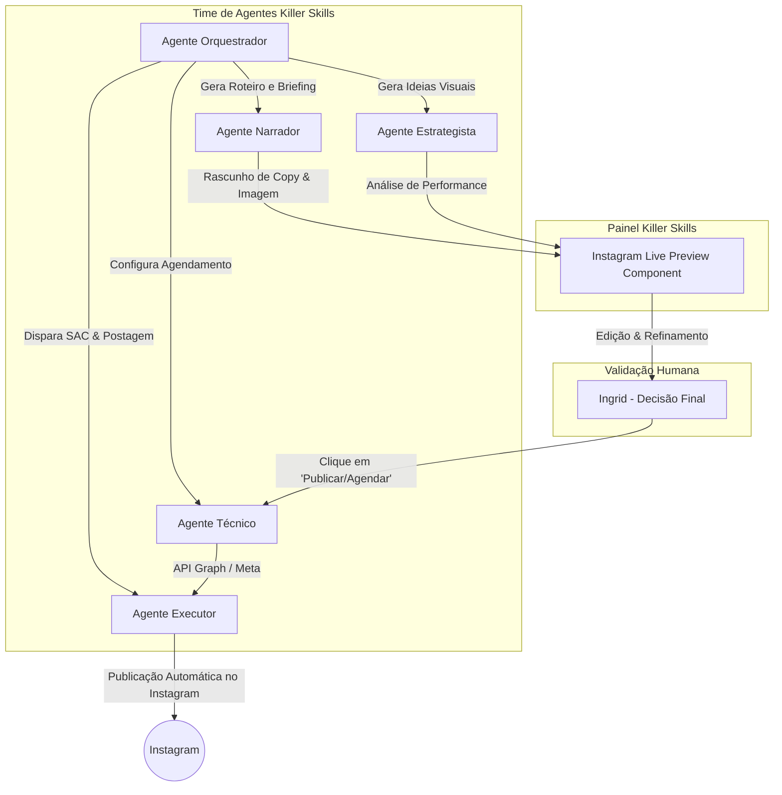

# Estudo de Caso Estratégico: Killer Skills + Ingrid Sinkovitz
## Slogan: "Killer Skills — Nossos Agentes Trabalham por Você!"
### Automatizando a Operação de 09 Contas com Agentes de IA (Human-in-the-Loop)

Este documento formaliza o **Estudo de Caso de Viabilidade Operacional** para a plataforma **Killer Skills**, utilizando o contrato real da estrategista digital Ingrid Sinkovitz (Grupo Orletti — 09 contas de Instagram, 72 posts/mês) como o *Ideal Customer Profile* (ICP) da plataforma. 

---

## 1. O Perfil do Cliente & O Gargalo Operacional

Ingrid Sinkovitz representa a clássica "agência de uma pessoa só" ou estrategista de elite altamente sobrecarregada. Para atender o contrato do Grupo Orletti, as demandas mensais são massivas:

```
Demandas Mensais: 72 posts (copywriting + briefings) + 9 relatórios analíticos + SAC diário em 9 contas
```

### Gargalos Críticos Mapeados:
1. **Bloqueio Criativo & Volume (Narrador):** Roteirizar Reels e redigir copies de legendas de forma atrativa e diferenciada para 9 marcas simultâneas.
2. **Coordenação Criativa (Executor):** Elaborar briefings detalhados para designers e videomakers, o que consome horas de digitação e alinhamento de referências visuais.
3. **Logística de Postagem (Técnico):** Agendar, testar links, verificar hashtags e publicar manualmente 72 peças por mês.
4. **SAC & Moderação (Executor):** Responder directs e comentários diariamente em 9 contas distintas.

---

## 2. A Solução: Arquitetura de Agentes no Killer Skills

Para libertar Ingrid da operação braçal mantendo-a no controle estratégico total (**Human-in-the-Loop**), distribuímos as demandas entre o time de agentes do Killer Skills:



---

## 3. O Recurso de Ouro: "Instagram Live Preview & Autopilot"

Em vez de Ingrid operar em planilhas frias ou painéis de agendamento complexos, o Killer Skills oferece um **Simulador de Feed do Instagram em Tempo Real**. 

### O Fluxo da Mágica (Passo a Passo):

```
[Módulo Ideação] ──> [Módulo Preview Visual] ──> [Aprovação da Ingrid] ──> [Fila de Postagem]
```

1. **A Ideação Inteligente:**
   * O **Agente Narrador** escreve a legenda (copy) com base nas pautas aprovadas e gera uma sugestão de imagem/vídeo utilizando inteligência generativa ou puxa o asset enviado pelo designer de Ingrid.
2. **O Preview 1:1 (Instagram Feed Replica):**
   * A tela do Killer Skills exibe um componente visual idêntico ao aplicativo móvel do Instagram.
   * Ingrid vê a foto/vídeo renderizados, a legenda formatada com emojis perfeitos, a foto de perfil da marca e a disposição visual no feed de 9 blocos.
3. **A Edição Human-in-the-Loop:**
   * Ingrid pode clicar diretamente no texto do preview para fazer pequenos ajustes de tom ou corrigir palavras. Ela é a diretora criativa final.
4. **O Autopilot Publisher (Fila Inteligente):**
   * Satisfeita com o preview, Ingrid clica no botão dourado **`Aprovar & Agendar`**.
   * O **Agente Técnico** e o **Agente Executor** assumem. Eles colocam o post na fila do banco de dados, configurado segundo a agenda de horários nobres de engajamento de cada uma das 9 marcas.
   * O sistema faz o disparo direto via API da Meta na data agendada. A Ingrid pode fechar o computador e descansar, sabendo que as postagens serão executadas impecavelmente.

---

## 4. O Impacto no Modelo de Negócios do Killer Skills

Este estudo de caso prova que o Killer Skills não é apenas um "gerador de textos", mas um **Sistema Operacional de Automação de Agências**.

| Tarefa Manual de Ingrid | Tempo Gasto Anteriormente | Tempo com Killer Skills | Papel da Ingrid com IA |
| :--- | :--- | :--- | :--- |
| Criar 72 roteiros e copies | ~24 hours / mês | ~2 horas (revisando opções) | Apenas refinar e dar o tom de voz |
| Montar briefings criativos | ~12 hours / mês | ~1 hora (autogerados) | Validar ideias visuais sugeridas |
| Agendar e postar em 9 contas | ~18 hours / mês | ~0.5 hora (aprovação em lote) | Clicar em "Aprovar & Agendar" no Preview |
| **Total de Tempo Gasto** | **~54 horas / mês** | **~3.5 horas / mês** | **Foco 100% estratégico e criativo** |

> [!TIP]
> Com essa economia colossal de **50 horas mensais**, a Ingrid ganha largura de banda para gerenciar o dobro de contas (de 9 para 18) ou simplesmente desfrutar de mais tempo livre, elevando a margem de lucro do seu contrato de R$ 12.000,00 para patamares incríveis!

---

## 5. Killer Skills vs. ChatGPT Genérico: A Diferença Estratégica de Valor

Embora Ingrid já utilize o ChatGPT em sua rotina, o uso de um chat genérico representa um abismo operacional em relação ao ecossistema do Killer Skills:

*   **O Limite do ChatGPT Genérico (O Processo "Picotado"):**
    *   **Sem Contexto Fixo:** Ingrid precisa abastecer o prompt toda vez com o tom de voz e regras de cada uma das 9 marcas do Grupo Orletti.
    *   **Sem Integração Visual:** O ChatGPT cospe apenas texto bruto. Ingrid precisa manualmente copiar a copy, colar no Canva ou enviar para o designer, baixar a mídia, criar uma planilha de aprovação para enviar ao cliente e, após aprovado, agendar tudo manualmente no Meta Business Suite de cada conta.
    *   **Desgaste de Prompting:** Ela atua como "programadora de prompt", gastando energia criativa para fazer a IA entender o tom refinado.
*   **O Poder do Killer Skills (O Processo "Cockpit"):**
    *   **Contexto Nativo:** O banco de dados do Killer Skills já possui o DNA de cada marca do Grupo Orletti. O Agente Narrador escreve com autoridade sobre Jeep, Hyundai, Toyota ou BYD sem necessidade de prompts gigantes.
    *   **Fluxo Unificado (All-in-One):** O texto gerado já é montado diretamente no simulador visual 1:1, permitindo ajustes na hora com o mouse.
    *   **Execução Direta:** Um único clique em "Aprovar & Agendar" faz a publicação rodar silenciosamente pelo VPS, eliminando 100% da fadiga operacional de copiar-colar.

---

## 6. Análise Financeira Real de Créditos e Custos (Foco Grupo Orletti)

Para provar a viabilidade econômica absurda do Killer Skills para o perfil da Ingrid, realizamos uma simulação financeira baseada no consumo real das **9 contas / 72 posts mensais** do contrato de **R$ 12.000,00/mês**.

### 📊 A Fórmula de Consumo de Créditos por Post
Como os criativos (fotos e vídeos dos carros e eventos) já são fornecidos brutos pelo Grupo Orletti, Ingrid **não consome** créditos pesados de geração de imagem ou vídeo generativo por IA (Creative Engine). Seu consumo se resume aos agentes de copy, formatação e postagem:

1.  **Narrador (Copywriting Persuasivo / Pautas):** 5 créditos por post.
2.  **Editor (Curadoria - Escalonamento, Presets e Compressão WebP):** 10 créditos por post.
3.  **Executor (Postagem Automatizada via API no VPS):** 20 créditos por post.
*   **Custo Médio por Post:** **35 créditos**.

### 💸 Simulação de Custos Mensais em Reais (R$)
No modelo pré-pago do Killer Skills, onde **R$ 50,00 = 5.000 créditos** (ou seja, `1 crédito = R$ 0,01` ou 1 centavo):

*   **Volume Mensal:** 72 posts.
*   **Créditos Totais no Mês:** `72 posts * 35 créditos = 2.520 créditos / mês`.
*   **Custo Financeiro Real (R$):** `2.520 * R$ 0,01` = **R$ 25,20 / mês**!!!

### 📈 A Arbitragem da Margem de Lucro
Essa análise financeira revela números chocantes e extremamente valiosos para o Estudo de Caso:

*   **Faturamento Mensal do Contrato:** **R$ 12.000,00**
*   **Custo de APIs/Créditos no Killer Skills:** **R$ 25,20** (apenas **0.21%** do faturamento do contrato!).
*   **Margem de Lucro Líquida da Operação:** **99.79%**!!!
*   **Alavancagem de Valor Hora de Ingrid:**
    *   *Sem Killer Skills (54 horas de trabalho manual picotado):* R$ 12.000,00 / 54h = **R$ 222,22 / hora**.
    *   *Com Killer Skills (revisão de 3.5 horas + R$ 25,20 de custo):* (R$ 12.000,00 - R$ 25,20) / 3.5h = **R$ 3.421,37 / hora**!!!
    *   **Ganho de Eficiência:** A hora de trabalho de Ingrid passa a valer **15 vezes mais**, liberando-a para fechar mais 3 contratos idênticos ou gozar de tempo livre absoluto.

---
*Documento de Planejamento de Produto — Killer Skills v1.0 — Criado com Antigravity.*
