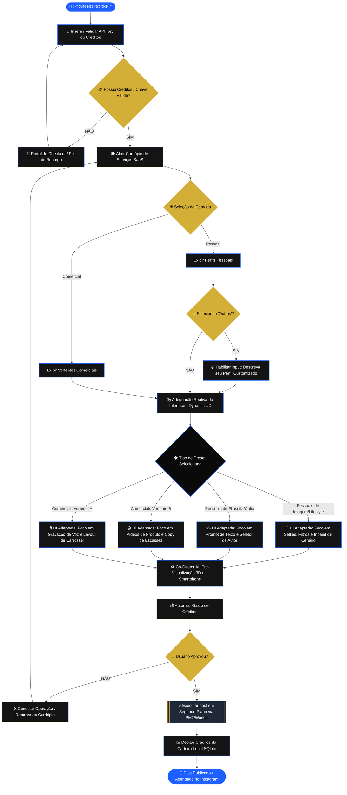

# 🗺️ Mapeamento de Jornada dos Clientes, Presets e Consumo de Créditos
## Projeto Killer Skills — Versão Estratégica 1.0 (Maio de 2026)

Este documento detalha o funcionamento prático do modelo de cobrança **Pay-per-Use (Créditos Pré-Pagos)** integrado com a **Categorização Real de Clientes (Pessoal vs. Comercial)** implementada no Construtor de Prompts. Ele serve como guia conceitual para o desenvolvimento da lógica de negócio e da dinâmica de UX adaptativa.

---

## 🎭 1. A Categorização de Clientes (Estrutura Real do Produto)

A jornada no Killer Skills é dividida em **duas grandes Camadas de Atuação**, cada uma com seus respectivos **Presets de Posicionamento** que guiam os Agentes de IA:

### 👤 1.1. Camada Pessoal (Identidade & Prestígio)
Focada em profissionais liberais, formadores de opinião, advogados, investidores e médicos que desejam projetar autoridade, inteligência ou status social nas redes.
*   **Intelectual / Culto:** Tom sofisticado, ganchos filosóficos e referências clássicas.
*   **Criativo / Rebelde:** Roteiros disruptivos, tom provocativo e design futurista.
*   **Autoridade / Vitorioso:** Foco em bastidores ricos, lifestyle magnético e depoimentos de sucesso corporativo.
*   **Alegre / Carismático:** Legendas amigáveis, humor sutil e forte conexão emocional com seguidores.
*   **Narcisista:** Fotos tratadas em cenários luxuosos e legendas poéticas para engajamento em lotes.
*   **Outros (Descrever abaixo):** Aciona um campo dinâmico de texto onde o usuário digita sua própria identidade customizada (ex: *Minimalista Filosófico*, *Aventureiro Tecnológico*).

### 🏢 1.2. Camada Comercial (Consistência & Mercado)
Focada em empresas, e-commerces e prestadores de serviços de marketing que buscam escala, campanhas estruturadas e conversão em massa.
*   **Vertente A (Agências Digitais & Curadores):** Lote de carrosséis, automações complexas e relatórios estatísticos.
*   **Vertente B (Pequenos Negócios & Euquipe):** Foco em provas sociais de estoque dinâmico, promoções rápidas e engajamento local.

---

## 🍽️ 2. O Cardápio de Serviços AI & Custos de Consumo

| Camada | Preset Selecionado | Custo em Créditos | Operações de IA Acionadas |
| :--- | :--- | :--- | :--- |
| **Pessoal** | Intelectual / Culto | **75 créditos** | Narrador AI (Marco Aurélio/Sêneca) + Imagens minimalistas Flux. |
| **Pessoal** | Autoridade / Vitorioso | **140 créditos** | Editor facial de alta fidelidade + Inpainting de cenários de luxo. |
| **Pessoal** | Narcisista | **105 créditos** | Recorte de silhueta + Fusão de fundos turísticos (Maldivas/Paris). |
| **Comercial**| Vertente B (Pequenos Negócios) | **330 créditos** | Luma Video API (mãos embalando produtos) + Copywriting de escassez. |
| **Comercial**| Vertente A (Agências/Mentores) | **200 créditos** | Transcrição Whisper + Roteirizador de Carrossel de 4 páginas + Flux. |

---

## 🗺️ 3. Fluxograma BPMN Geral (Página Inteira)

O processo conceitual mapeia a jornada operacional do cliente e a **adequação reativa das telas** conforme as suas seleções:

---

## 🔍 4. Detalhamento Técnico das Etapas

### 🔑 Etapa 1: Validação de Combustível
O processo inicia validando se o usuário possui saldo no banco SQLite local (`killer_skills.db`). Caso a conta esteja zerada, a tela bloqueia a criação e exibe um painel de faturamento Pix.

### 🛎️ Etapa 2: A Escolha das Camadas (Pessoal vs. Comercial)
O usuário seleciona se a sua postagem de hoje é de natureza **Pessoal** ou **Comercial**.
*   Se **Pessoal**: A interface exibe os presets de Identidade (Culto, Rebelde, Vitorioso, Narcisista).
*   Se **Comercial**: Exibe as Vertentes Comerciais A e B.
*   **O Gatilho "Outros":** Caso o usuário selecione "Outros (Descrever abaixo)", o Flet destrava dinamicamente o campo `custom_preset_input`, alterando a sua borda para dourado (`#d4af37`) e permitindo a digitação livre da identidade customizada.

### 🎭 Etapa 3: Adequação Reativa das Telas (Dynamic UX)
A tela se molda automaticamente conforme o preset selecionado:
*   Se **Narcisista**: Oculta inputs textuais pesados e foca na interface de upload de fotos de rosto com dropdown de cenários de ostentação.
*   Se **Especialista/Vertente A**: Mostra o player de áudio para carregar recados de voz e diagramador de slides.

### 👁️ Etapa 4: Pré-Visualização no Smartphone 3D & Débito
A IA do **Co-Diretor** monta o storyboard, exibe o mockup no celular central e solicita a aprovação do faturamento em créditos. Uma vez aprovada, a tarefa é executada de forma silenciosa no background via PM2 e o banco de dados realiza o débito final.
