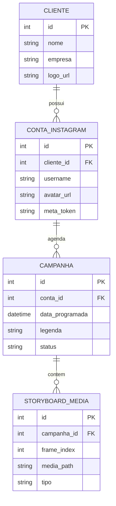

# 🎨 Arquitetura Visual e Estrutura do App (SaaS Espaçoso & Minimalista)

Este documento detalha o blueprint da nova arquitetura de interface e banco de dados do **Killer Skills**. O foco mudou de um dashboard denso de tela única para uma plataforma de cockpit de luxo (SaaS), espaçosa, com respiro visual, efeitos de vidro (glassmorphism) e coleções de dados organizadas.

---

## 🗺️ 1. Menu Lateral Metálico (Sidebar Minimalista)
Uma barra lateral ultra-elegante, fixa no canto esquerdo, com transparência metálica (`glassmorphism`), ícones minimalistas e indicadores luminosos discretos. Ela serve como o "corredor" da mansão de criação.

*   **`💼 Clientes` (Client Workspace):** Gestão de marcas e conexões (Coleções do Firestore).
*   **`📁 Almoxarifado` (Media Center):** Grid gigante e limpo para uploads e gerenciamento de arquivos brutos.
*   **`🎬 Creative Studio` (Storyboard):** Área focada na coprodução com os agentes IA, com ampla área de digitação e timelines limpas.
*   **`📱 Simulador & Planner` (Instagram Feed):** O celular 1:1 simulado ao lado da agenda visual de posts da semana.

---

## 💻 2. Os 4 Espaços Dedicados (Telas Espaçosas)

### 💼 Tela A: Painel de Clientes (Firestore-Style Collections)
Uma área ampla onde o usuário cadastra e visualiza suas contas contratadas.
*   **Visual:** Cards flutuantes com degradê metálico para cada Cliente (ex: *Grupo Orletti*).
*   **Contas Conectadas:** Ao clicar no card do cliente, expande uma sub-coleção mostrando os usernames conectados (ex: `@hyundaiorletti`, `@jeeporletti`), seus status de autenticação (OAuth/Meta) e chaves ativas.
*   **Ação:** Botão minimalista "Adicionar Cliente" ou "Conectar Conta Instagram".

### 📁 Tela B: Almoxarifado Central (Media Library)
Substitui a coluna apertada de upload por uma central de mídia espaçosa e responsiva.
*   **Grid Fluido:** Thumbnails grandes das imagens e vídeos com bordas arredondadas e badges de formato (Foto/Vídeo/Reels).
*   **Filtros Inteligentes:** Busca por Cliente, Tipo de Mídia (Upload/Gerado por IA) e Data.
*   **Upload Area:** Um painel pontilhado estilizado ("Drag & Drop") ocupando 100% da largura superior com animação de progresso metálica.

### 🎬 Tela C: Creative Studio (Área de Coprodução)
O coração criativo. Livre de distrações laterais.
*   **Storyboard Principal:** Os 4 quadros (cards) de storyboard ganham tamanho expandido na tela, dispostos horizontalmente como um rolo de filme de cinema.
*   **Painel da Legenda:** Um campo de texto amplo e espaçoso para a Ingrid ditar, escrever e refinar a copy estratégica.
*   **Central do Co-Diretor IA:** Um botão destacado ("Chamar Narrador") que abre uma janela flutuante com sugestões de ganchos, hashtags e roteiros alternativos gerados na hora pelos agentes.

### 📱 Tela D: Simulador Instagram & Planner
O simulador do Instagram em escala real de smartphone (iPhone mockup minimalista) ao lado de um calendário estratégico.
*   **Feed Simulator (1:1):** O celular posicionado no centro com bordas perfeitas, mostrando username, foto de perfil circular da marca ativa, imagem em alta definição e legenda com suporte a quebra de linha real.
*   **Planner Semanal:** Um calendário em grid de segunda a domingo para visualizar visualmente a distribuição dos 72 posts mensais pelas 9 contas.
*   **Botão de Ação Master:** O botão dourado **`Aprovar & Agendar`** que dispara o Executor.

---

## 💾 3. Estrutura de Coleções (Banco de Dados SQLite)
Para suportar o cadastro dinâmico de clientes sem misturar os canais de postagem, o banco `agente_insta.db` utiliza um modelo estruturado baseado em coleções relacionais:

---

## 🎨 4. Estética de Luxo & Transparência
*   **Cores:** Fundo ultra-escuro de cinema (#050505), cartões com fundo translúcido (#0F111A com 40% de opacidade) e bordas finas com brilho metálico escovado.
*   **Blur de Fundo:** Círculos suaves de gradiente em azul cobalto, ouro velho e cinza espacial se movendo lentamente ao fundo para dar profundidade de design tridimensional.
*   **Responsividade:** Transições suaves usando o motor reativo do Flet ao mudar de tela pelo menu lateral.
