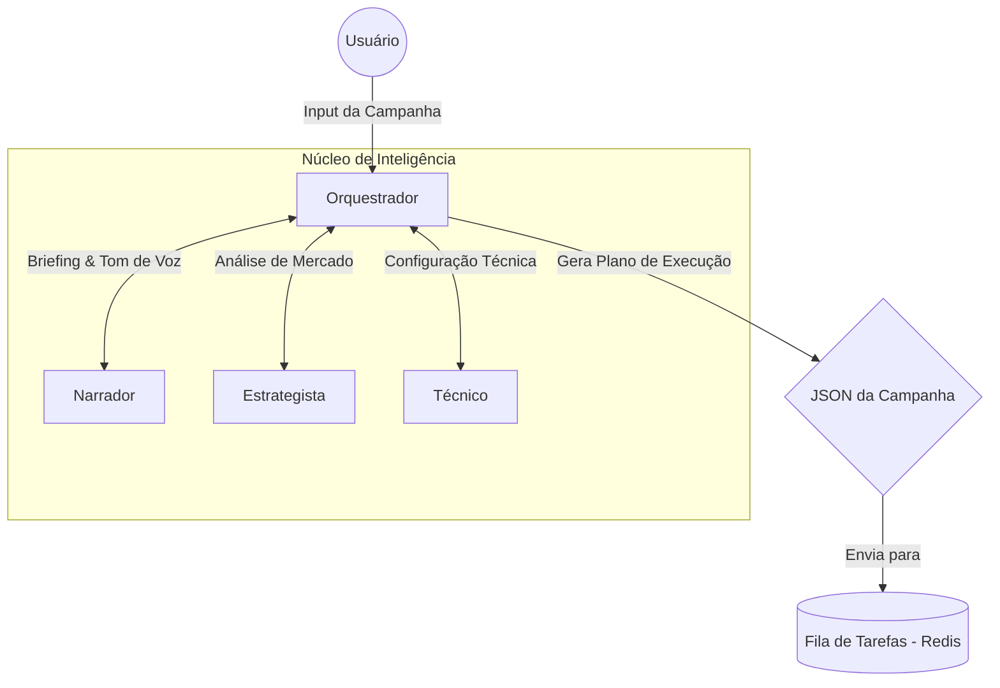
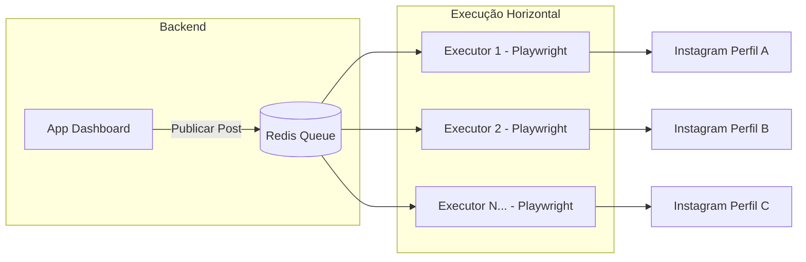
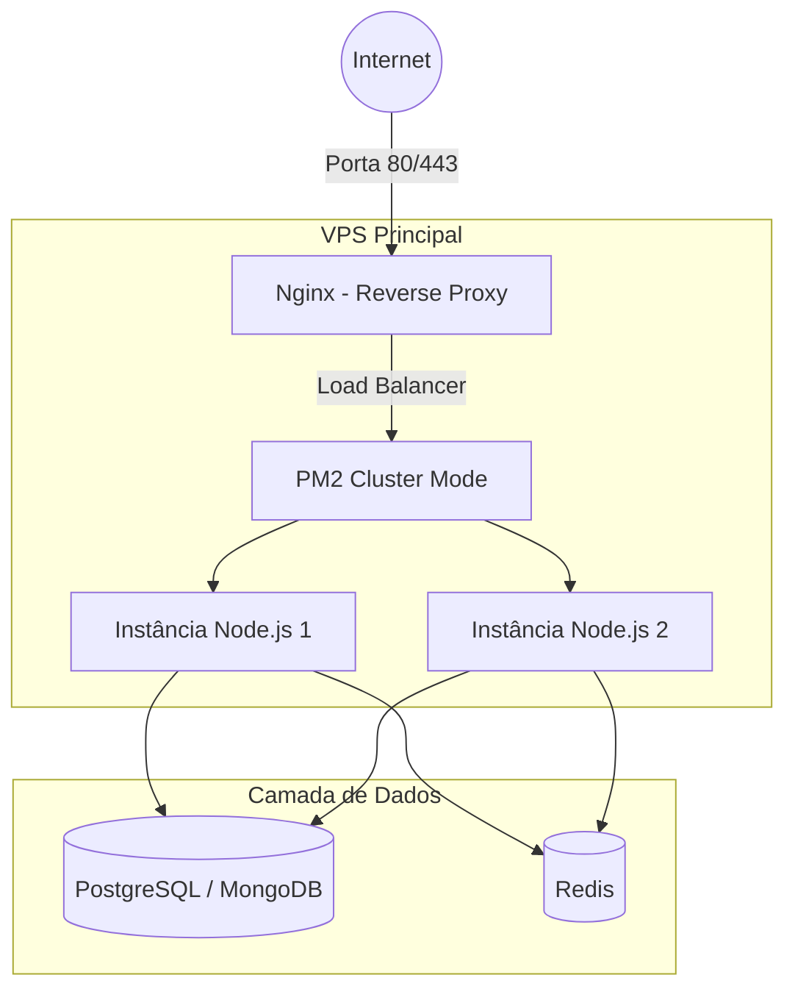

# 📊 Diagramas de Fluxo e Arquitetura - Killer Skills

Estes diagramas detalham o funcionamento técnico do sistema e foram desenhados com foco em escalabilidade.

## 1. Fluxo de Inteligência (Equipe de Agentes)
Mostra a interação entre os agentes especializados até a geração do plano de execução.

---

## 2. Esteira de Automação (Executores)
O uso de uma fila permite que você escale horizontalmente, adicionando quantos robôs forem necessários sem sobrecarregar o app principal.

---

## 3. Arquitetura de Servidor no VPS
Estrutura recomendada para o ambiente de produção na Contabo.

