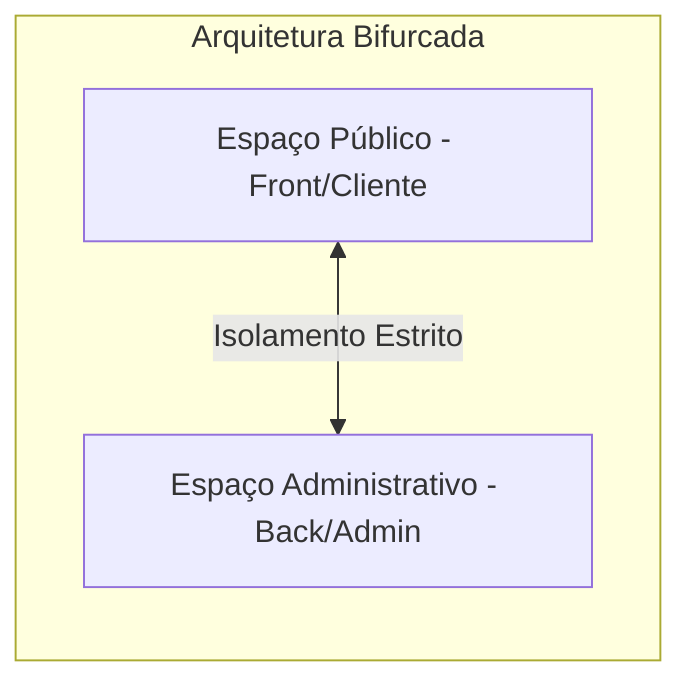

# 🧠 VIES ONTOLÓGICO: ESTRATÉGIA (CONCEPÇÃO DO PRODUTO)

**Data de Revisão:** 21 de Maio de 2026  
**Diretor Criativo (Genera):** Ingrid & Genera  
**Sargento de Tecnologia (Lincoln):** Antigravity  

---

## 1. MANIFESTO DE VISÃO

### 1.1. Premissa Sociológica
O comportamento humano nas redes sociais contemporâneas é regido por dois motores fundamentais e distintos: a busca existencial por **Validação/Prestígio Social** no âmbito individual, e a necessidade pragmática de **Presença/Eficiência de Vendas** no âmbito comercial. O Instagram tornou-se o principal palco de projeção de autoridade, identidade e tração mercadológica.

### 1.2. A Tese do Projeto: O Potencializador de Presença Digital (PPD)
O **Killer Skills** atua como uma engine inteligente que elimina o abismo técnico e cognitivo existente entre o usuário e a produção de uma presença digital premium. O sistema não automatiza apenas o envio; ele estrutura, refina e potencializa a narrativa visual e textual de acordo com a exata intenção de posicionamento do usuário.

---

## 2. ARQUITETURA BIFURCADA DO SISTEMA (CLIENTE VS. ADMIN)

Para garantir máxima segurança operacional, blindagem de código e uma experiência do usuário impecável, o ecossistema do Killer Skills é dividido em dois espaços funcionais independentes:

### 2.1. ESPAÇO PÚBLICO / OPERACIONAL (Front-End & Clientes)
*   **Foco Primordial:** Curadoria estética de alto nível, gestão de campanhas e facilidade de agendamento de posts.
*   **Nível de Acesso:** Clientes finais, criadores de conteúdo e gerentes de marca.
*   **Engrenagem de Inteligência (Agentes Operacionais):**
    *   **Redator (C1):** Geração de legendas e copies estratégicas.
    *   **Curador de Mídias (C2):** Corte técnico e compressão estética das peças.
    *   **Postador Autônomo (C3):** O motor silencioso de publicação final (Playwright).
    *   **Analista de Métricas (C5):** Coleta de performance pública.
*   **Camada Pessoal (Identidade & Prestígio):** Focada em autoestima e prestígio individual. Os usuários selecionam presets modulares (*Intelectual, Criativo, Rebelde, Alegre, Narcisista, Vitorioso*) ou customizam no campo *Outros*.
*   **Camada Comercial (Consistência & Mercado):** Focada em tração real de negócios, atendendo à *Vertente A (Agências/Curadores)* ou *Vertente B (Pequenos Negócios/Euquipe)*.

### 2.2. ESPAÇO ADMINISTRATIVO / DESENVOLVIMENTO (Back-End & Engenharia)
*   **Foco Primordial:** Engenharia de software, estabilidade de infraestrutura, deploys automatizados, migrações de dados e manutenção do ecossistema.
*   **Nível de Acesso:** Equipe de engenharia de software (Mesa Redonda) e administradores do sistema.
*   **Engrenagem de Inteligência (Agentes de Desenvolvimento):**
    *   **Maestro/Orquestrador (Lincoln):** Cérebro analítico de arquitetura.
    *   **Técnico/Engenheiro:** Especialista em código de produção, VPS e otimização.
    *   **Estrategista de Infraestrutura:** Modelagem de escalabilidade horizontal.
*   **A Cockpit ADM (Painel Admin):** Nossa central de comando interna que usamos para gerar código estável, configurar servidores, monitorar tabelas SQLite (`killer_skills.db`) e orquestrar deploys para o VPS de produção.

---

## 3. O DIFERENCIAL ESTRATÉGICO & COMERCIAL

Esta divisão arquitetural garante que:
1.  **Segurança Total:** Chaves de API, credenciais de banco de dados e rotinas de deploy fiquem blindadas no painel ADM, inacessíveis para o usuário final.
2.  **UX Imaculada:** O cliente final opera uma interface fluida, relaxante (com trilha sonora calma) e focada inteiramente em sua marca, livre de poluição técnica.

---
*ESTRATEGICAMENTE DEFINIDO POR GENERA & LINCOLN*  
*Maio 2026 | CONVERSÃO, PRESTÍGIO E EFICIÊNCIA*
