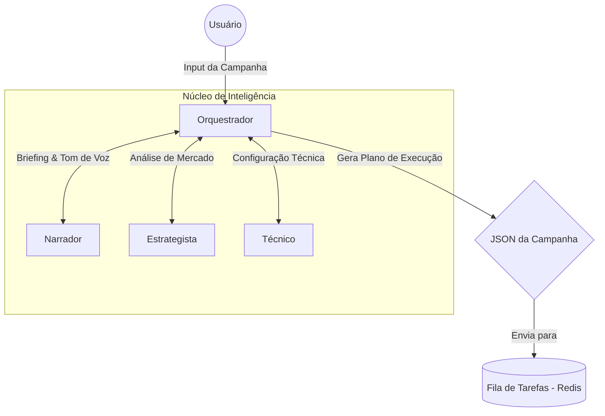
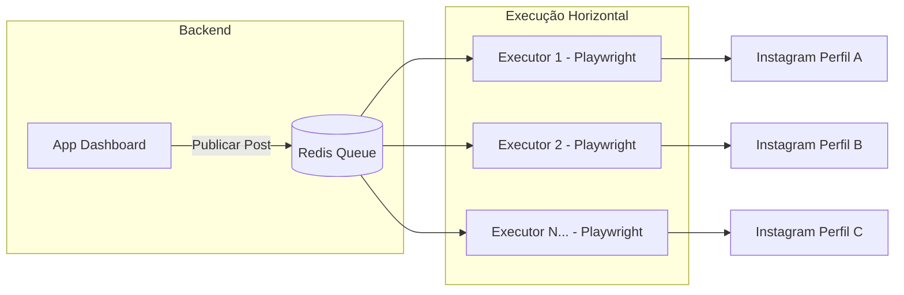
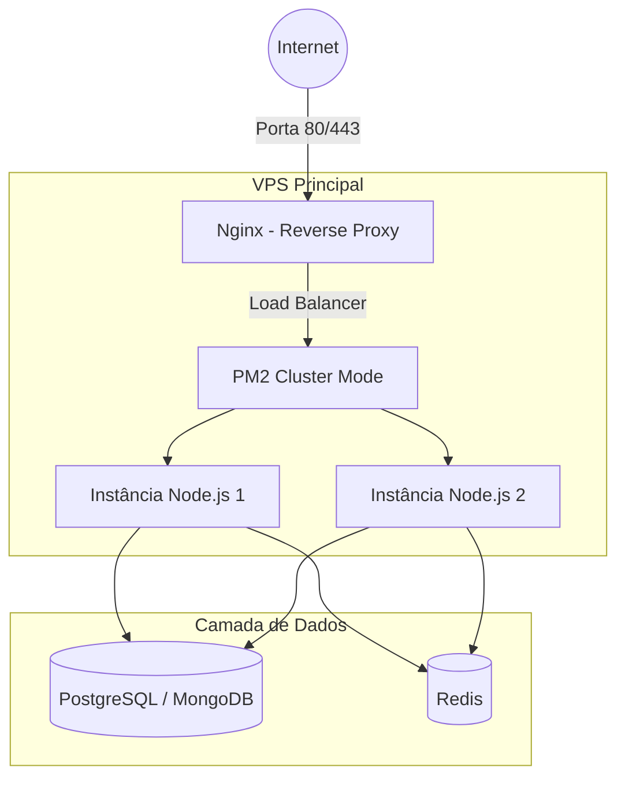
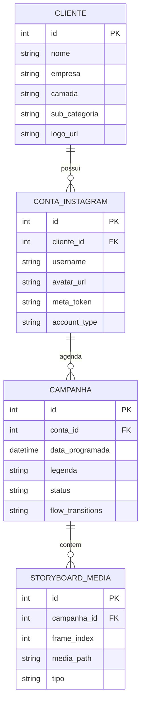

# 📐 VIÉS EPISTEMOLÓGICO: PLANEJAMENTO (DESENHO DA SOLUÇÃO)

Este documento mapeia os relacionamentos, fluxos lógicos e a estrutura física da arquitetura de software do **Killer Skills**, servindo como referência segura de execução técnica.

---

## 1. DIAGRAMAS DE FLUXO & ESCALABILIDADE

### 1.1. Fluxo de Inteligência (Equipe de Agentes)
Mostra a interação entre os agentes especializados até a geração do plano de execução.

### 1.2. Esteira de Automação (Executores)
O uso de uma fila Redis e workers independentes em Playwright permite que o sistema escale horizontalmente, adicionando quantos robôs forem necessários sem sobrecarregar a aplicação principal.

### 1.3. Arquitetura de Servidor no VPS (Infraestrutura Contabo)
Estrutura de alta performance e disponibilidade para produção.

---

## 2. ARQUITETURA VISUAL & ESTRUTURA DO APP (COCKPIT BIFURCADO)

A interface é concebida em duas cockpits visuais separadas com efeitos de vidro (`glassmorphism`), respiro visual e alta sofisticação:

### 2.1. O ESPAÇO PÚBLICO (Cockpit do Usuário Final)
Um SaaS de curadoria e coprodução de altíssimo nível estético:
*   **Menu Lateral Metálico (Sidebar Minimalista):**
    *   **`💼 Clientes`:** Gestão de marcas e conexões (Coleções do Firestore/SQLite).
    *   **`📁 Almoxarifado`:** Grid gigante e limpo para uploads e gerenciamento de arquivos brutos.
    *   **`🎬 Creative Studio` (O Player Interativo):** Substitui o antigo grid estático por um **Smartphone Player Interativo 3D** (mockup de celular premium centralizado com cantos arredondados, notch dinâmico e glow neon).
        *   **Modo de Edição (Edit Mode):** As 4 setas direcionais ficam livres para navegação entre os 4 slots de frames. Mudar de frame grava as direções de transição espacial (horizontal `"right"` para Carrossel de Feed ou vertical `"down"` para Reels/Stories) no vetor de fluxo global (`flow_transitions`).
        *   **Modo de Simulação (Simulation Mode):** O Player atua como simulador real do usuário final. Ele oculta setas livres e exibe apenas as setas gravadas em cada transição. O layout se adapta perfeitamente: moldura clássica do Instagram com curtidas/legenda para Carrosséis, ou tela cheia com barra de progresso no topo para Reels/Stories.
    *   **`📱 Simulador & Planner`:** Celular mockup ao lado da agenda visual de posts da semana.
*   **Aparato Criativo (Onboarding):** Ritual de boas-vindas com trilha sonora integrada (Lo-fi/Chill) e preenchimento intuitivo do perfil pessoal ou comercial.

### 2.2. O ESPAÇO ADMINISTRATIVO (Central ADM de Desenvolvimento)
Nossa central privativa de engenharia e autoria:
*   **O Construtor de Prompts ADM:** Módulo 100% integrado e funcional que lê as diretrizes em `/docs/` e gera as Ordens de Serviço completas para os Agentes de Desenvolvimento codificarem com precisão.
*   **Console de Banco de Dados:** Visualização rápida do status da base SQLite (`killer_skills.db`).
*   **Monitor de Infraestrutura & PM2:** Relatório em tempo real do status do worker em segundo plano (`background_worker.py`) e do status da fila de postagens no VPS.

---

## 3. MODELO DE BANCO DE DADOS (SQLite - `killer_skills.db`)

Para suportar o cadastro dinâmico de clientes e a segregação de dados multilocatário, o banco relacional utiliza a seguinte estrutura:

### 3.2. INTEGRAÇÃO MODULAR DO CONSTRUTOR DE PROMPTS
O Construtor de Prompts está desacoplado em `APP/prompt_constructor.py`.
*   **Função Principal:** `build_prompt_constructor_view(is_admin, page)` retornando um layout reativo e limpo de Flet.
*   **Frente Pública (is_admin=False):** Oferece geração de prompts criativos de Personas, Campanhas e Posts com acoplamento reativo para seleção de presets e customização rápida.
*   **Frente ADM (is_admin=True):** Oferece geração de instruções de engenharia técnica, permitindo aos desenvolvedores codificar com base nas diretrizes oficiais dos pilares.

### 3.3. FLUXO DE LOGIN "JOGO LIMPO" (OAUTH 2.0 & ASSISTENTE IA)
Segurança e transparência máximas em conformidade com as regras de desenvolvimento:
*   **Facebook Login for Business:** O app não solicita senhas cruas do usuário. A conexão é realizada por login social seguro do Facebook, onde o sistema obtém e salva o `meta_token` (Token de longa duração de 60 dias).
*   **Assistente IA de Conversão:** Caso o usuário conecte uma conta pessoal incompatível com a publicação automatizada, o sistema dispara um pop-up de suporte interativo ensinando o usuário, em 3 passos visuais amigáveis, a alterar sua conta para Criador ou Comercial no celular de forma 100% gratuita.

### 3.4. EXPORTAÇÃO "LINK NA BIO" (FUNIL INTERATIVO DO CLIENTE)
Inspirado na arquitetura de Flow da Ingrid:
*   Os fluxos de navegação mistos (horizontal/vertical) desenhados no Player podem ser exportados como uma página web responsiva de alta performance e carregados direto no VPS.
*   O link oficial na bio do cliente (`killerskills.app/cliente/campanha`) traz os seguidores do Instagram para dentro da física e navegação exatas desenhadas no Player, garantindo uma taxa de conversão comercial gigantesca!

---

## 4. ESTÉTICA DE LUXO & TRANSPARÊNCIA
*   **Cores:** Fundo ultra-escuro de cinema (`#050505`), cartões com fundo translúcido (`#0F111A` com 40% de opacidade) e bordas finas com brilho metálico escovado.
*   **Logo Oficial:** A `Logo_Final.png` metalizada e majestosa importada de `/Imagens` exibida com destaque (altura de `95px` e alinhamento centralizado) no topo de Creative Studio.
*   **Blur de Fundo:** Círculos suaves de gradiente em azul cobalto, ouro velho e cinza espacial se movendo lentamente ao fundo para dar profundidade de design tridimensional.
*   **Responsividade:** Transições suaves usando o motor reativo do Flet ao mudar de tela pelo menu lateral.

---

## 5. INFRAESTRUTURA DE PRODUÇÃO (VPS CONTABO & DEPLOY INTEGRADO)
*   **Domínio de Produção Ativo:** `www.killerskills.com.br` (configurado e ativo, plano de 6 meses contratado).
*   **Servidor VPS:** Contabo (IP `31.220.102.2`), rodando sob controle de processos PM2 (`pm2 restart killer-skills`).
*   **Fluxo de Deploy Automatizado Integrado (DX Suprema):** O script `run.sh` local executa `deploy.sh` automaticamente na inicialização. Isso garante que:
    1. Toda alteração de código local seja adicionada, commitada com timestamp e empurrada ao GitHub (`git push`).
    2. O servidor VPS Contabo puxe a atualização de código (`git pull`) e reinicie o processo PM2 (`pm2 restart killer-skills`).
    3. A versão de produção web (`www.killerskills.com.br`) e a versão desktop local fiquem 100% sincronizadas instantaneamente a cada clique no atalho dourado.

---
*Documento de Referência Arquitetural e Execução Técnica. Killer Skills 2026.*
