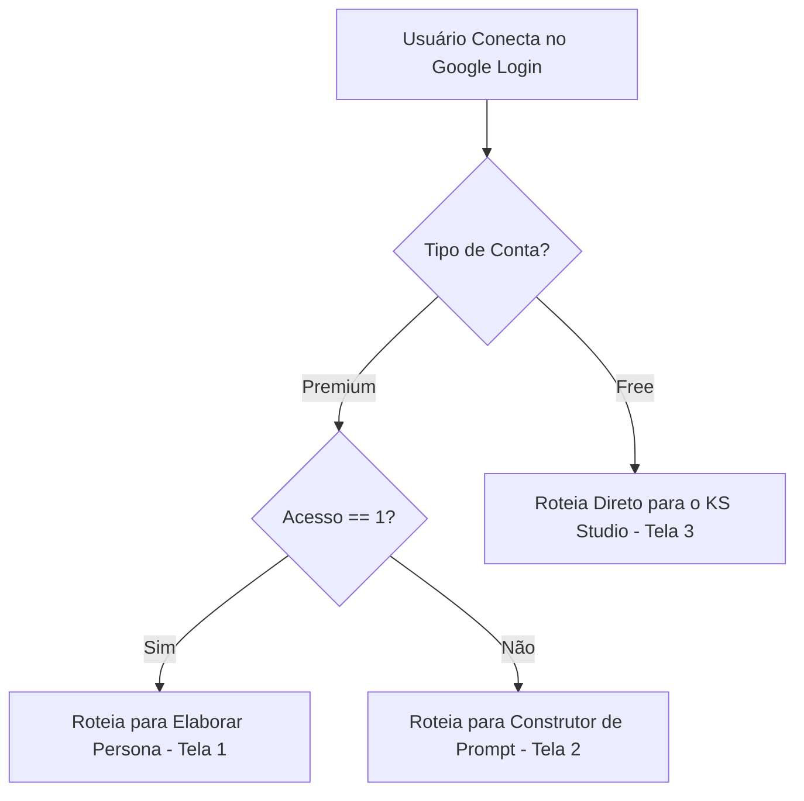

# 📊 TABELA DE CRUZAMENTO: PLANOS & SERVIÇOS DO KILLER SKILLS

Este documento estabelece o mapeamento lógico e operacional das funcionalidades disponíveis para as contas **Free** e **Premium**, servindo como guia estrito para o desenvolvimento do Router Guard e do renderizador do Cockpit.

---

## ⚖️ 1. Matriz de Serviços e Recursos

| Serviço / Recurso | Plano Free (Gratuito) | Plano Premium (Pago) | Tela de Execução (Cockpit) |
| :--- | :---: | :---: | :--- |
| **Simulador de Feed Instagram (1:1)** | **Incluso** | **Incluso** | Tela 3 (KS Studio) |
| **Criação Manual de Storyboard / Flow** | **Incluso** | **Incluso** | Tela 3 (KS Studio) |
| **Upload de Mídias Locais** | **Incluso** | **Incluso** | Tela 3 / Almoxarifado |
| **Agendamento de Post** | **Incluso** | **Incluso** | Tela 3 (KS Studio) |
| **Postagem Direta (API Playwright)** | **Incluso** | **Incluso** | Tela 3 (KS Studio) |
| **Elaborar Persona (Sliders MEVA)** | ❌ *Bloqueado* | **Incluso** | Tela 1 (Onboarding) / Menu Lateral |
| **Diagnóstico de Persona (Título Duplo)** | ❌ *Bloqueado* | **Incluso** | Sidebar Direita (Módulo Persona) |
| **Criação de Textos por IA (Gemini)** | ❌ *Bloqueado* (Apenas legenda manual) | **Incluso** (Legenda lapidada via tom MEVA) | Tela 3 (KS Studio) |
| **Tratamento Estético (Canvas WebP 80%)** | ❌ *Bloqueado* (Upload em formato bruto) | **Incluso** (Compressão e otimização automatizada) | Pipeline de Upload |
| **Criação de Imagens via IA (Text-to-Image)** | ❌ *Bloqueado* | **Incluso** | Tela 2 (Serviços) |
| **Criação de Vídeo via IA (Image-to-Video)** | ❌ *Bloqueado* | **Incluso** | Tela 2 (Serviços) |
| **Criação de Flow via IA (Storyboarding)** | ❌ *Bloqueado* | **Incluso** | Tela 2 (Serviços) |
| **Armazenamento no Almoxarifado** | ⚠️ **Temporário** (Deletado 12 dias após post) | **Permanente** (Biblioteca arquivada em definitivo) | Tela Biblioteca |

---

## 🔀 2. Comportamento do Roteamento Dinâmico (Router Guard)

A navegação inicial pós-autenticação é determinada pela contagem de acessos (`acesso`) e o tipo de conta (`accountType`) registrados no banco de dados:

### 👑 2.1. Regras para Contas Premium
1. **Primeiro Acesso (`acesso === 1`):** Redirecionamento obrigatório para a **Tela 1 (Elaborar Persona)** para calibrar os 12 sliders arquetípicos MEVA e fixar a identidade conceitual da conta.
2. **Acessos Recorrentes (`acesso > 1`):** Direciona direto para a **Tela 2 (Serviços & Construtor de Prompt)** para agilidade operacional.
3. **Reelaboração:** Fica disponível permanentemente no menu lateral o botão **"1 - PERSONAS"** para que o usuário possa re-calibrar a matriz e sobrescrever a Persona anterior a qualquer instante.

### 🍃 2.2. Regras para Contas Free
1. **Acesso Direto:** É direcionado **sempre** de forma direta para o **KS Studio (Tela 3)**.
2. **Restrição Física de Menu:** O botão **"1 - PERSONAS"** é desabilitado/ocultado no menu lateral da Sidebar, uma vez que contas gratuitas não possuem inteligência arquetípica de Persona e criam seus fluxos manualmente.
