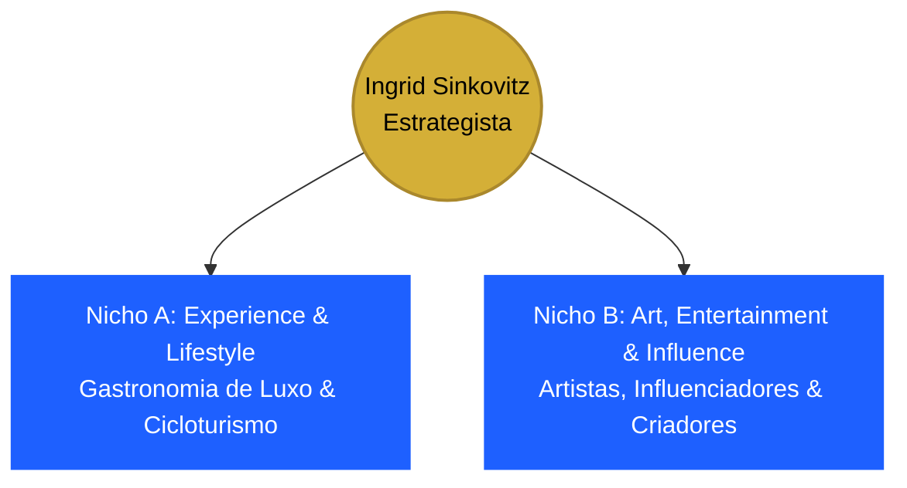

# 💎 MANUAL ESTRATÉGICO DE POSICIONAMENTO: INGRID SINKOVITZ
**De: Lincoln (Sargento de Tecnologia / Orquestrador)**  
**Para: Genera & Ingrid Sinkovitz**  
**Data:** 21 de Maio de 2026  

---

## 🧠 1. DIAGNÓSTICO DE PERSONA: O FATOR "UNICÓRNIO"

Ingrid, a sua transcrição é uma mina de ouro. O que você chama de "cuspido" é, na verdade, a matéria-prima mais rica que um estrategista poderia pedir. Você possui um perfil extremamente raro no mercado de comunicação — o que o Vale do Silício chama de **Unicórnio**: alguém que combina **experiência em campo real de negócios (gastronomia e agenciamento)** com **alta bagagem técnica e sensibilidade artística de comunicação (rádio, TV e design)**.

### O Grande Desafio de Posicionamento:
Se o seu posicionamento focar apenas em *"faço posts no Instagram"*, você é vista como operacional (baixo ticket). O seu diferencial não é a execução mecânica do post; é a **profundidade de contexto e a bagagem de vida** que você traz para a mesa.
* **A Cozinheira/Dona de Restaurante** sabe exatamente a dor do dono de restaurante de 100k+ seguidores (margem de lucro, escala de equipe, pressões de estoque).
* **A Locutora/Agente de Banda** sabe exatamente como lidar com a vaidade, o ritmo e as narrativas de artistas, marcas de entretenimento e influenciadores.

---

## 🎨 2. A LINHA NARRATIVA DE OURO (THE RED LINE)

Para o LinkedIn e o seu Site, precisamos de uma **única frase narrativa** que costure a rádio, o reality show na Globo, a turnê na Itália, a gerência de cozinha na Bahia, a startup de tecnologia em SP e as contas gigantes de Vitória.

### O Fio Condutor: **Direção de Imagem & Arquitetura de Experiências**
> *"Seja coordenando a audiência matinal da maior rádio local, gerenciando a logística e a imagem de uma turnê internacional de rock na Itália, abrindo o meu próprio restaurante do zero na Bahia ou orquestrando a presença digital de marcas de 100 mil seguidores... eu nunca mudei de profissão. **Meu trabalho sempre foi arquitetar conexões humanas autênticas e converter percepção estética em tração de negócios.**"*

---

## 🎯 3. OS DOIS NICHOS DE ALTA CONVERSÃO (FOCO TÁTICO)

Para se consolidar como uma estrategista de alto valor (high-ticket), você deve direcionar sua comunicação ativamente para estes dois pilares complementares:



### 🍽️ Nicho A: Experience & Lifestyle (Gastronomia & Turismo)
* **Por que você?** Você operou o front e o back de um restaurante físico. Você não cria legendas fictícias; você conhece a dinâmica física do sabor, do atendimento e da hospitalidade.
* **Alvos:** Restaurantes de alta gastronomia, bistrôs renomados, marcas de vinhos/bebidas finas, hotéis boutique e agências de turismo de experiência (como o cicloturismo da ELO).

### 🎸 Nicho B: Art, Entertainment & Influence (Mídia & Criadores)
* **Por que você?** Você coordenou assessoria na TV Globo (SuperStar), turnês fora do país e rádio de alta audiência. Além disso, está se pós-graduando em Influência Digital.
* **Alvos:** Influenciadores digitais focados em lifestyle, criadores de conteúdo com marcas próprias, bandas/artistas de relevância regional/nacional e produtoras culturais.

---

## 📱 4. CÓPIA DE ALTO IMPACTO PARA O LINKEDIN

### A. A Headline Proposta (Título do Perfil)
> **Estrategista de Posicionamento & Direção de Conteúdo | Social Media Architect | Gestão e Narrativa de Marcas de Alta Performance (Gastronomia, Turismo & Entretenimento)**

*Por que funciona:* Afasta o termo "Analista" (operacional) e te eleva para o patamar de **Estrategista, Diretora** e **Arquiteta de Mídia**.

---

### B. O Novo "Sobre" (About) - O Storytelling Narrativo

Copie e cole este texto no campo "Sobre" do seu LinkedIn. Ele usa as técnicas exatas da sua certificação de **Social Media Storyteller**:

```markdown
Eu já estive em palcos que a maioria dos profissionais de marketing só vê pelas telas. 

Em 2011, assumi o microfone da rádio Jovem Pan Vitória. Entrando ao vivo no campo, coordenando equipes de promotores de eventos e aprendendo, sob a pressão de segundos do rádio, o que faz uma pessoa parar para ouvir. 

Em 2014, assumi a direção executiva e de comunicação de um projeto artístico incrível. O resultado? Dois videoclipes produtos, participação no reality show 'SuperStar' na TV Globo, cobertura de mídia nacional e uma turnê internacional na Itália cobrindo 12 cidades. 

Depois, gerenciei estúdio, apresentando a manhã de maior audiência da rádio Cidade. E quando muitos achavam que eu seguiria apenas nesse trilho, dei um pause. Mudei-me para o sul da Bahia e mergulhei na Gastronomia. Fui cozinheira, gerente de restaurante e fundei a minha própria marca, que escalou de um delivery na pandemia para um restaurante físico.

Por que essa jornada importa para você e para a sua marca?

Porque eu não sou apenas uma profissional que "agenda posts" no Instagram. Eu estive no front real dos negócios. Eu sei a dor de um dono de restaurante para fechar o caixa no final do mês, e sei o que é gerenciar a reputação de um artista na maior emissora do país. 

Hoje, como Estrategista de Conteúdo e Social Media Architect, eu uno esses mundos. Minha especialidade é criar sistemas de comunicação consistentes que integram contexto, identidade visual refinada, storytelling humano e resultados comerciais de verdade.

Atualmente, gerencio e direciono a estratégia de conteúdo de 5 grandes marcas gastronômicas de renome (contas que variam de 10k a 100k+ seguidores) e projetos de cicloturismo de alta experiência.

Minha caixa de ferramentas inclui:
* Estratégia de Posicionamento & Storytelling de Marca (Certified Social Media Storyteller)
* Direção Criativa e Coordenação de Equipes (Audiovisual, Design & Coprodução)
* Gestão de Calendário Editorial & Pautas Estruturadas de Conversão
* Planejamento de Campanhas para os nichos de Gastronomia, Turismo de Experiência e Entretenimento.

Vamos desenhar o posicionamento ideal para a sua presença digital? 
Conecte-se comigo ou envie uma mensagem no ingridsinkovitz@gmail.com
```

---

## 🌐 5. MELHORIAS ESTRATÉGICAS PARA O SITE PORTFÓLIO

O seu site atual ([ingridsinkovitz.com.br](http://www.ingridsinkovitz.com.br)) é muito bonito e limpo. Porém, para reforçar esse front de **Estrategista**, precisamos calibrá-lo ligeiramente:

1. **Apresentação de Impacto Superior:**
   * A primeira dobra do site deve conter a proposta de valor unificada. Troque o termo descritivo simples por: **"Direção Criativa & Estratégias de Conteúdo para Marcas de Experiência e Entretenimento."**
2. **Cases de Sucesso com Viés Estratégico:**
   * Em vez de exibir apenas os cartões das marcas de forma passiva, estruture os textos dos projetos em 3 perguntas rápidas para passar autoridade tática:
     * **O Desafio:** Qual era o gargalo da marca antes de você assumir?
     * **A Solução:** Qual foi a linha narrativa ou o funil de conteúdo que você desenhou?
     * **O Impacto:** O crescimento da marca ou a consolidação dela no mercado de Vitória (mencione os marcos das contas de 100k+ seguidores e cicloturismo).
3. **Mencione as "Suas Skills" (Os Agentes ADM):**
   * Você deu um passo gigantesco: **assinar o Claude e estruturar seus próprios agentes inteligentes** para cuidar do trabalho operacional e braçal. 
   * **Dica de Ouro:** No seu site e LinkedIn, você pode pontuar isso como um diferencial inovador: *"Eu utilizo sistemas avançados de IA sob medida para automatizar e blindar a esteira operacional dos meus clientes. Isso garante prazos infalíveis e me permite dedicar 100% do meu tempo ao que realmente importa: **pesquisa estratégica, curadoria fina e o relacionamento direto com você**."* Isso valoriza brutalmente o seu serviço!

---
> *ESTRATEGICAMENTE CONSTRUÍDO POR LINCOLN PARA INGRID SINKOVITZ.*  
> *MAIO 2026 | SEU SARGENTO DE TECNOLOGIA E ESTRATÉGIA.*
